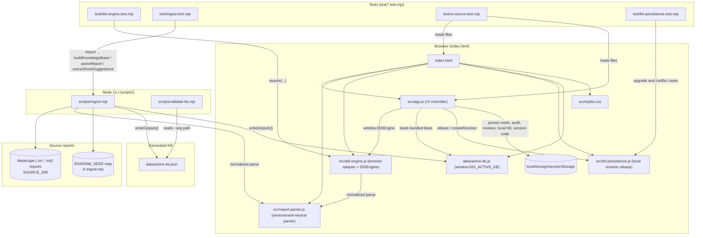
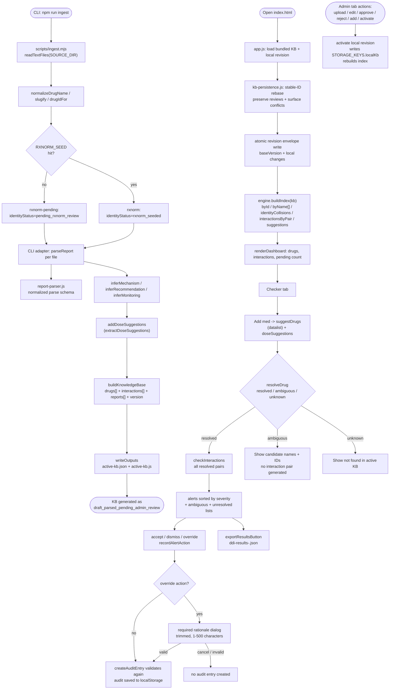

# Knowledge-base revision identity

`scripts/ingest.mjs` creates a content-addressed revision ID. It deterministically orders source reports by portable relative path, hashes each relative path and exact file bytes, and includes the parser version, schema version, and normalization configuration. `generatedAt` remains provenance metadata and the absolute source directory is deliberately excluded, so identical clinical inputs reproduce the same revision across runs and locations.

# DDI-Checker 1.1.0 — Architecture & Data Flow

## 1. Module dependency & layering

## 2. Runtime data-flow (the four layers described in the README)

## Key relationships the diagrams capture

- **Three entry points** into the same domain logic: Node CLI ingestion (`ingest.mjs`), Node CLI validation (`validate-kb.mjs`), and the browser app (`index.html` + `app.js`). Only `ddi-engine.js` (UMD) and the JSON/JS KB exports are shared between Node and the browser.
- **Fail-closed identity resolution**: `byName` stores candidate arrays, deduplicated by drug ID. `resolveDrug` returns a discriminated `resolved` / `ambiguous` / `unknown` result. `checkInteractions` only pairs resolved identities; ambiguity is rendered with candidate names and IDs.
- The KB has **two physical forms**: `data/active-kb.json` (canonical, validated by `validate-kb.mjs`) and `data/active-kb.js` (browser-ready `window.DDI_ACTIVE_KB`). Browser uploads + admin approvals sidestep the CLI and write a local revision only into browser localStorage.
- `ddi-engine.js` exposes its public surface (`buildIndex`, `resolveDrug`, `suggestDrugs`, `checkInteractions`, `createAuditEntry`, `extractDoseSuggestions`, `parseReportText`) at the UMD tail — that's the only API `src/app.js` consumes via `window.DDIEngine`.
- **Ingest vs. upload parity**: `src/report-parser.js` owns environment-neutral parsing and returns a normalized schema. `ddi-engine.js::parseReportText` adds browser upload identity/review metadata; `scripts/ingest.mjs::parseReport` adds seeded RxNorm identity, filesystem provenance, and CLI review metadata. Filesystem traversal and cryptographic revision hashing remain outside the parser.
- **One-way write from CLI → browser KB**: ingestion regenerates `active-kb.js` and `active-kb.json`; the browser local-kb revision never flows back to disk (README calls this out as a production-side migration target).

Test coverage boundaries:
- `test/ddi-engine.test.mjs` → `src/ddi-engine.js`
- `test/ingest.test.mjs` → `scripts/ingest.mjs`
- `test/ui-source.test.mjs` → `index.html` + `src/app.js` (static source assertions only, no DOM run)

## Potential follow-ups worth a look

- `test/report-parser-parity.test.mjs` runs every malformed and representative report in `test/fixtures/reports/` through both adapters and asserts their normalized drugs, interactions, clinical fields, ordering, and excerpts are identical.
- Browser-only local KB revision (localStorage) and the CLI-generated `active-kb.js` both end up as "active" with different scopes — worth a doc note if reviewers ever edit via both paths.
- `validate-kb.mjs` only validates the JSON file, not the `.js` window export; if `active-kb.js` is regenerated from `active-kb.json` they always match via `writeOutputs`, but they're still two files that can drift if someone edits one by hand.
## Version-aware local KB persistence

`src/kb-persistence.js` keeps the generated bundle immutable and stores a compact local overlay. Startup rebases the overlay by stable IDs, imports bundled additions and corrections, honors bundled deletions, preserves matching review fields, records changed/removed conflicts, and atomically replaces the saved envelope. `test/kb-persistence.test.mjs` covers new, changed, removed, conflicting-edit, and legacy full-snapshot migrations.

## KB validation gate

scripts/validate-kb.mjs validates root shape before traversal, unique IDs, normalized name/alias ownership, review provenance, parser confidence, revision consistency, and duplicate/conflicting unordered pairs. The --clinical-active mode also requires active production metadata, at least one approved record, RxNorm-resolved identities, and non-low confidence for every approved record. test/validate-kb.test.mjs covers readable malformed-root and malformed-record diagnostics plus activation eligibility.

## Storage boundary

`src/storage-adapter.js` is the browser/in-memory adapter seam. `src/app.js` owns transactional UI behavior: it snapshots mutable state, creates a delta envelope through `src/kb-persistence.js`, writes once through the adapter, and publishes rebuilt indexes/UI success only after `{ ok: true }`. Failed writes preserve the prior durable and in-memory state and surface the persistent `#storageFailure` alert.
