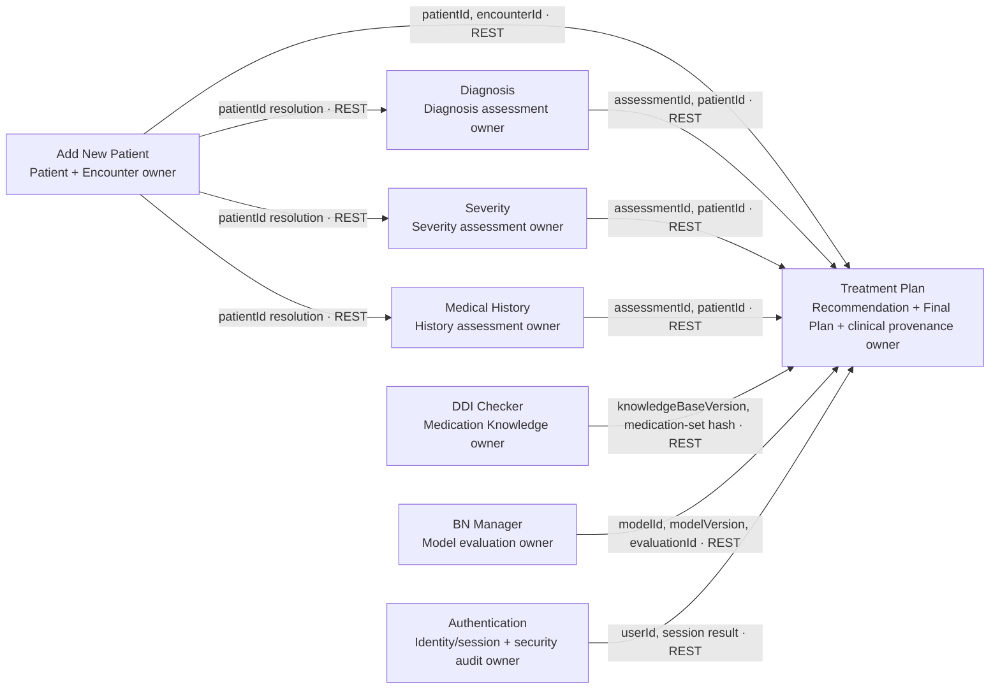

# INSIGHT System Context Map

Status: normative architecture contract  
Version: 1.0.0  
Depends on: TP-01

## Non-negotiable ownership rule

Every persisted entity instance has exactly one owning module. The owner defines its canonical identifier, schema, lifecycle, validation rules, persistence, and authoritative REST representation. Other modules may retain a versioned snapshot or cache a stable reference, but **must not read, write, migrate, attach to, or otherwise access another module's database or files**.

All cross-module relationships use a stable identifier carried through a versioned internal REST interface. Display aliases such as `patientCode` may be resolved through the owning module but are not foreign keys of record. A cached copy is never authoritative and must retain its source module, interface version, resource version or ETag, retrieval time, and response hash.

## Entity ownership

| Entity | Sole owner | Canonical identifier | Authoritative REST interface | Other modules may retain |
|---|---|---|---|---|
| Patient | Add New Patient | `patientId` UUID | Add New Patient versioned patient interface | `patientId`; display alias; schema-versioned snapshot with provenance |
| Encounter | Add New Patient | `encounterId` UUID | Add New Patient versioned encounter interface | `encounterId`; encounter date/time snapshot with provenance |
| Assessment | Producing assessment module, uniquely selected by `assessmentType` | `assessmentId` UUID | Owning module's versioned assessment interface | `assessmentId`, `assessmentType`; immutable normalized snapshot with provenance |
| Medication Knowledge | DDI Checker | `knowledgeBaseId` plus immutable `knowledgeBaseVersion` | DDI Checker versioned medication-knowledge and interaction interface | medication concept IDs, knowledge version, exact findings snapshot |
| Recommendation | Treatment Plan | `recommendationRunId` UUID and `planId` UUID | `/api/treatment-plan/v1/recommendation-runs` and plan interface | stable IDs and authorized response snapshots |
| Final Plan | Treatment Plan | `planId` UUID plus monotonic `planVersion` | `/api/treatment-plan/v1/plans/{planId}` | stable plan/version reference; authorized immutable copy where required |
| Audit | Treatment Plan for treatment-plan clinical provenance | `auditEventId` UUID | `/api/treatment-plan/v1/plans/{planId}/audit` | stable event references; authorized projections only |

“Sole owner” for Assessment is resolved per instance, not through a shared assessment database:

| `assessmentType` | Sole owning module |
|---|---|
| `diagnosis` | Diagnosis |
| `severity` | Severity |
| `medical_history` | Medical History |

Adding an assessment type requires updating this table before release. A type cannot be registered to two modules. Treatment Plan owns only its immutable `ClinicalInputSnapshot`; normalizing an assessment does not transfer ownership of the source assessment.

Authentication remains the sole owner of authentication/security audit events. Those are a different entity from treatment-plan clinical provenance and are not exposed through the plan audit route.

## Context relationships

Arrows describe identifier-bearing REST calls, not database dependencies.

## Relationship rules

1. Patient relationships use canonical `patientId` UUID. `patientCode` is lookup/display data only.
2. Every plan belongs to one `encounterId`; Treatment Plan cannot create or mutate the encounter record.
3. Assessment references include `assessmentId`, `assessmentType`, owning module, schema version, and source version.
4. Medication findings bind to the exact medication-set hash and immutable knowledge-base version.
5. Model evaluations bind to stable model and evaluation identifiers plus model version/hash.
6. Recommendations and plans store upstream identifiers and immutable source snapshots; upstream changes create a new snapshot and run, never an in-place rewrite.
7. User attribution uses Authentication's stable `userId`; Treatment Plan does not duplicate credentials or session authority.
8. REST responses are validated against their declared schema version before persistence or use.

## Prohibited coupling

- Cross-module SQL, SQLite file access, shared ORM models, shared tables, or foreign keys spanning databases.
- Writing another module's upload, cache, migration, or data directory.
- Treating a copied payload as authoritative without provenance and version metadata.
- Joining modules through `patientCode`, names, timestamps, medication display text, or other mutable aliases.
- Importing another module's implementation to bypass its REST interface.
- Cascading deletes across modules. Owners publish lifecycle state; consumers handle stale or unavailable references explicitly.

## Ownership change control

Ownership transfer requires a versioned architecture decision, source-owner export contract, destination-owner import contract, identifier preservation plan, migration validation, and a coordinated interface transition. No code change may silently create a second writer.
