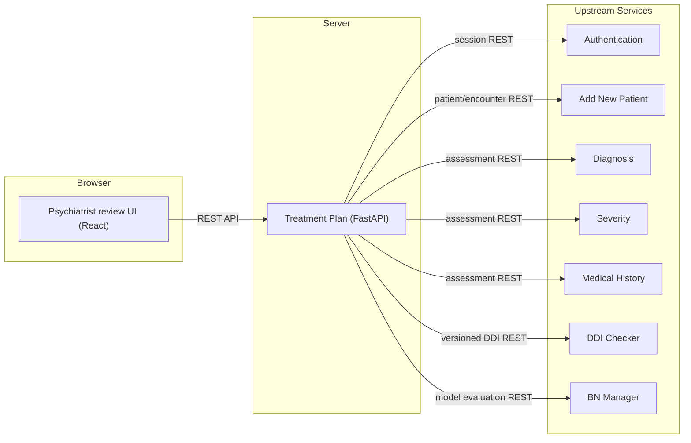

# INSIGHT Treatment Plan

An independently deployable INSIGHT module for producing explainable, patient-specific treatment-plan recommendations. It supports structured psychiatrist review and modification, and preserves immutable finalized plans with complete provenance.

> **Current status:** The backend services for plan generation, editing, finalization, follow-up supersession, and the persistence/retention layer are implemented, along with a React-based user interface for psychiatrist review. The UI currently uses synthetic data and is not yet connected to the backend APIs. The module remains **blocked for clinical release** pending completion of the TP-01 release gate, which includes approvals for clinical policies and knowledge governance.

## Table of Contents

- [Overview](#overview)
- [Architecture](#architecture)
- [Getting Started](#getting-started)
  - [Prerequisites](#prerequisites)
  - [Running the Application](#running-the-application)
- [Repository Layout](#repository-layout)
- [Verification](#verification)
- [Core Capabilities](#core-capabilities)
- [Development Roadmap](#development-roadmap)
- [Security, Privacy, and Provenance](#security-privacy-and-provenance)

## Overview

The Treatment Plan module orchestrates versioned internal REST calls to other independent INSIGHT modules (e.g., Diagnosis, Severity, Medical History, DDI Checker) to assemble a clinical input snapshot. It then applies data-quality and safety policies to generate an explainable **Primary Treatment Plan**.

A psychiatrist remains the final clinical authority and may accept or modify this draft plan in the frontend application. The finalization process creates an immutable, attributable **Final Treatment Plan** with complete data provenance.

For more information on the clinical data lifecycle and state model, see the detailed sections further down.

## Architecture

The system consists of a Python backend using the FastAPI framework and a React frontend built with Vite.



The complete normative context map is in [`CONTEXT-MAP.md`](CONTEXT-MAP.md).

- **Backend**: A FastAPI application that exposes a versioned REST API (`/api/treatment-plan/v1`). It handles business logic, orchestration, and persistence.
- **Frontend**: A React application providing the psychiatrist review workspace.
- **Persistence**: The backend uses a repository pattern (`treatment_plan.repository.Repository` Protocol). `SQLiteRepository` is the default, `InMemoryRepository` is used for tests, and `PostgreSQLRepository` is available when the `psycopg` driver is installed. A single ordered, reversible migration set in `treatment_plan/migrations` renders for both SQLite and PostgreSQL through `MigrationRunner`.

## Getting Started

### Prerequisites

- Python 3.10+
- Node.js 18+ and npm

### Running the Application

First, install the dependencies for both the backend and frontend.

From the repository root:
```powershell
# Install Python dependencies
python -m pip install -r .\requirements-dev.txt

# Install frontend dependencies
cd .\frontend
npm install
cd ..
```

You can run the application in two ways:

#### 1. Development Mode (Recommended for UI work)

Run the backend and frontend servers in separate terminals for hot-reloading.

**Terminal 1: Start the Backend**
```powershell
.\run.ps1
```
The backend will be available at `http://localhost:8000`.

**Terminal 2: Start the Frontend**
```powershell
cd .\frontend
npm run dev
```
The frontend development server will be available at `http://localhost:5173` (or another port if 5173 is busy).

#### 2. Production-like Mode

This mode builds the frontend and has the backend serve the static files, simulating a production deployment.

**Step 1: Build the Frontend**
```powershell
cd .\frontend
npm run build
cd ..
```

**Step 2: Run the Backend**
```powershell
.\run.ps1
```
The backend will now serve the compiled frontend at `http://localhost:8000/modules/treatment-plan`.

## Repository Layout

The repository is structured as follows:

```
Treatment-Plan/
|-- contracts/         # Data contracts, schemas, and OpenAPI specs
|   |-- openapi/       # Versioned OpenAPI documents
|   `-- schemas/1.0.0/ # JSON Schema files per contract version
|-- frontend/          # React frontend application
|   |-- src/            # review-workspace state core, screen tests, styles
|   `-- dist/          # Compiled frontend served by the backend
|-- governance/        # ADRs, scope matrix, and context-ownership registry
|-- graphify-out/      # Generated knowledge graph artifacts (not authoritative)
|-- prototype/         # Disposable lifecycle prototype code
|-- scripts/           # Standalone verification and utility scripts
|-- tests/             # Python backend test suite (TP-01 to TP-19) and fixtures
|-- treatment_plan/    # Python backend (FastAPI application)
|   |-- migrations/    # Dialect-aware, reversible SQL migrations (0001-0006)
|   |-- policies/      # Versioned clinical policy JSON (synthesis, safety)
|   `-- app.py
|-- .dockerignore
|-- .gitignore
|-- CONTEXT-MAP.md     # Normative system context map
|-- Dockerfile
|-- HANDOFF.md         # Handoff document for developers
|-- compose.yaml       # Docker Compose file
|-- pyproject.toml     # Python project configuration
|-- README.md          # This file
|-- requirements.txt   # Python dependencies
|-- requirements-dev.txt
|-- run.ps1            # Script to run the backend
`-- test.ps1           # Script to run the backend test suite
```

## Verification

Run the complete backend test suite:
```powershell
.\test.ps1
```
or
```powershell
python -m unittest discover -s .\tests -v
```

Run the frontend test suite:
```powershell
cd .\frontend
npm test
```

Several scripts in the `scripts/` directory can be used to validate governance and contracts. For example, to evaluate the clinical release gate:
```powershell
python .\scripts\check_tp01_release_gate.py
```
The current expected result is `TP-01 RELEASE GATE: BLOCKED`, which is intentional.

The PostgreSQL repository contract is optional and only runs when `TP_TEST_POSTGRES_DSN` is set; otherwise `test_tp19_persistence.py` skips it.

## Core Capabilities

- **Clinical Context Assembly**: Gathers patient data from upstream services concurrently, handling timeouts, retries, and data validation.
- **Eligibility Policy**: Evaluates if there is sufficient data quality to proceed with generating a treatment plan.
- **BN Evaluation**: Orchestrates calls to Bayesian Network models for probabilistic recommendations, with `RepositoryBnEvaluationStore` persisting canonical immutable bundles through the repository seam.
- **Deterministic Safety Policy**: Applies deterministic clinical safety rules to the recommendations (e.g., allergies, contraindications).
- **Primary Plan Synthesis**: Generates a deterministic, explainable primary plan based on all inputs and policies.
- **DDI Check**: Performs a Drug-Drug Interaction check for the proposed medication set.
- **Psychiatrist Review Workspace**: A React-based UI for reviewing and editing the plan.
- **Append-only Edit Ledger**: Tracks all edits to a plan as an immutable, append-only log, with strong concurrency control.
- **Idempotent Finalization**: A robust finalization process with server-side safety checks, attributable overrides, and immutable storage of the final plan.
- **Follow-up Supersession (TP-18)**: Given a prior finalized plan and a Follow-up Delta, gathers a fresh source snapshot, revalidates and explains every Primary Plan section, and records an immutable successor relationship. The signed prior Final Plan is never rewritten.
- **Dialect-aware Persistence (TP-19)**: A single ordered, reversible migration set renders for both SQLite and PostgreSQL. SQLite adds `backup`/`restore` (with integrity checks); `PostgreSQLRepository` is available when the `psycopg` driver is installed. Tests cover UUID, idempotency, foreign-key, and JSON-envelope constraints.
- **Approval-gated Retention**: `RetentionPolicy` redacts expired PHI (snapshots, plans, items, findings, evidence) while preserving the immutable edit ledger and clinical provenance, and refuses to run without `privacy_officer` and `clinical_safety_officer` approvals.
- **Configuration and Logging**: `Settings.from_env` validates environment, trusted origins, session URL, and enforces HTTPS in production; structured logging is configured per `TP_LOG_LEVEL`.

## Development Roadmap

The authoritative, dependency-ordered roadmap is maintained in an external planning document. The general direction is to continue building out the features required for clinical release.

**Implemented milestones (TP-01 to TP-19) cover governance, contracts, the FastAPI/React scaffold, security, clinical context, eligibility, BN evaluation, safety, synthesis, DDI, the review UI, the edit ledger, finalization (with versioning and supersession), and the persistence/retention layer.**

**Next Steps:**
- Connect the frontend review workspace to the backend's authenticated REST APIs.
- Implement the remaining workflow routes (e.g., starting recommendation runs, wiring the OpenAPI `/plans/{planId}/supersede` route to `PlanSuperseder`).
- Conduct the required psychiatrist walkthrough of the prototype to get feedback on clinical workflows.
- Complete the outstanding stakeholder decisions required to pass the TP-01 clinical release gate.

## Security, Privacy, and Provenance

The implementation is designed with security and privacy as a priority:
- All protected routes require authentication and authorization via the central INSIGHT Authentication service.
- Mutations require CSRF protection.
- No PHI is stored in URLs, browser storage, or logs.
- Finalized plans are immutable and stored with complete provenance, including the exact versions of all source data used in the decision.
- Direct cross-module database or filesystem access is forbidden; all communication is over REST APIs.
