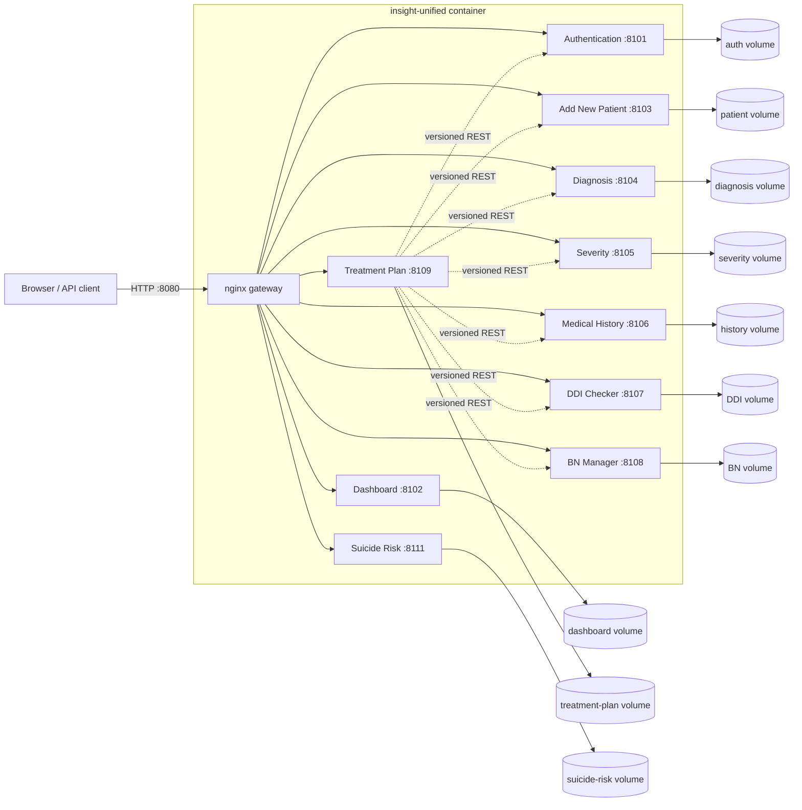

<div align="center">

# Insight CDSS

**Modular clinical decision support, delivered through one secure gateway**

Ten independently owned services. One Docker image. Separate persistence.
Clinician-controlled decisions.

</div>

---

> [!IMPORTANT]
> Insight is a research and development prototype. It supports clinical
> workflows but does not replace professional medical judgment. Treatment Plan
> remains blocked for clinical release pending its documented governance and
> policy approvals. Validate clinical rules, data, security controls, and local
> regulatory requirements before any real-world use.

## Contents

- [What Insight Does](#what-insight-does)
- [System Map](#system-map)
- [Modules](#modules)
- [Quick Start](#quick-start)
- [Configuration](#configuration)
- [Using the App](#using-the-app)
- [Operations](#operations)
- [Development](#development)
- [Verification](#verification)
- [Deployment Model](#deployment-model)
- [Security and Clinical Safety](#security-and-clinical-safety)
- [Documentation Index](#documentation-index)

## What Insight Does

Insight organizes a clinical workflow into bounded modules connected only by
REST contracts. Authentication owns identity and sessions. Patient intake owns
canonical patient records. Assessment modules own diagnosis, severity, and
history data. DDI Checker and Bayesian Network Manager provide versioned
decision-support inputs. Treatment Plan composes those inputs into explainable
recommendations for psychiatrist review.

Core design properties:

- **Clinician authority:** decision-support output remains reviewable and does
  not make autonomous clinical decisions.
- **Module boundaries:** modules communicate through REST instead of importing
  one another's implementation or reading one another's databases.
- **Isolated persistence:** each module receives its own SQLite database and
  named Docker volume.
- **Single ingress:** nginx exposes one loopback-bound gateway on port `8080`;
  internal module ports are never published by the supplied configuration.
- **Machine-checked deployment:** manifest, topology, routes, migrations,
  volume ownership, and graceful shutdown are covered by repository tests.
- **Auditable workflows:** modules preserve local audit, provenance, version,
  and review data where their contracts require it.

## System Map



`tini` is container PID 1. It starts
[`deployment/supervisor.py`](deployment/supervisor.py), which launches nginx
and all ten services from the commands in
[`deployment/manifest.json`](deployment/manifest.json). Any child process exit
causes orderly shutdown of the remaining process tree.

## Modules

| Module | Responsibility | Runtime | Gateway API | UI / module route |
| --- | --- | --- | --- | --- |
| [Authentication](Modules/Authentication-1.1.0/README.md) | Accounts, roles, sessions, CSRF, password rotation, disclaimer acceptance | Python / SQLite, `8101` | `/api/auth` | `/` or `/modules/authentication` |
| [Dashboard](Modules/Dashboard-1.2.0/README.md) | Role-aware workspace and module discovery | Python / SQLite, `8102` | `/internal/dashboard` | `/dashboard/` |
| [Add New Patient](Modules/Add-New-Patient-1.1.0/README.md) | Canonical patient intake and lookup | Python / SQLite, `8103` | `/api/add-new-patient/v1` | `/modules/add-new-patient` |
| [Diagnosis](Modules/Diagnosis-1.2.0/README.md) | Clinician-controlled DSM-5-TR criteria workflow | Python / SQLite, `8104` | `/api/diagnosis/v1` | `/modules/diagnosis` |
| [Severity](Modules/Severity-1.1.0/README.md) | Structured severity assessment | Node.js / SQLite, `8105` | `/api/v1` | `/modules/severity` |
| [Medical History](Modules/Medical-History-1.0.0/README.md) | Patient medical-history records | Node.js / SQLite, `8106` | `/api/internal/medical-history` | `/modules/medical-history` |
| [DDI Checker](Modules/DDI-Checker-1.2.0/README.md) | Versioned drug-interaction knowledge base, deterministic checks, review, and audit | Node.js / SQLite, `8107` | `/api/ddi-checker/v1` | `/modules/ddi-checker` |
| [BN Manager](Modules/BN-Manager-v.1.1.0/BN-Manager-v.1.1.0/README.md) | Bayesian-network model management and evaluation | Python / SQLite, `8108` | `/api/bn-manager/v1` | `/modules/bn-manager` |
| [Treatment Plan](Modules/Treatment-Plan/README.md) | Explainable plan generation, psychiatrist review, finalization, and provenance | Python / SQLite, `8109` | `/api/treatment-plan/v1` | `/modules/treatment-plan` |
| [Suicide Risk](Modules/Suicide-Risk-1.0.0/README.md) | C-SSRS Screen Version - Recent assessment, isolated workflow records | Node.js / JSON, `8111` | `/api/suicide-risk/v1` | `/modules/suicide-risk` |

Gateway paths are authoritative in
[`deployment/nginx.conf`](deployment/nginx.conf). Runtime identity, commands,
ports, and databases are authoritative in the deployment manifest.

## Quick Start

### Prerequisites

- Docker Engine 23 or newer
- Docker Compose v2
- Approximately 1 GB free disk space for image and runtime data
- Python 3.11 or newer for source-tree verification

The unified image itself pins Python `3.13.5` and Node.js `22.17.0`.

### Build and Run from Source

From repository root:

Linux, macOS, or WSL:

```bash
docker build -f deployment/Dockerfile -t insight-unified:dev .

export INSIGHT_UNIFIED_IMAGE='insight-unified:dev'
export AUTH_JWT_SECRET='replace-with-at-least-32-random-bytes'
export TP_AUTHENTICATION_SESSION_URL='http://127.0.0.1:8101/api/auth/session'
export TP_TRUSTED_INTERNAL_ORIGINS='http://127.0.0.1:8101'

docker compose -f deployment/compose.unified.yaml up -d --no-build
```

Windows PowerShell:

```powershell
docker build -f deployment/Dockerfile -t insight-unified:dev .

$env:INSIGHT_UNIFIED_IMAGE = 'insight-unified:dev'
$env:AUTH_JWT_SECRET = 'replace-with-at-least-32-random-bytes'
$env:TP_AUTHENTICATION_SESSION_URL = 'http://127.0.0.1:8101/api/auth/session'
$env:TP_TRUSTED_INTERNAL_ORIGINS = 'http://127.0.0.1:8101'

docker compose -f deployment/compose.unified.yaml up -d --no-build
```

Wait for startup, then check readiness:

```bash
curl --fail --show-error http://127.0.0.1:8080/readyz
python3 scripts/verify_unified_deployment.py unified \
  --base-url http://127.0.0.1:8080
```

On Windows PowerShell:

```powershell
curl.exe --fail --show-error http://127.0.0.1:8080/readyz
python .\scripts\verify_unified_deployment.py unified --base-url http://127.0.0.1:8080
```

Open <http://127.0.0.1:8080/>.

> [!WARNING]
> Seeded local administrator credentials are `Admin` / `Admin`. Change this
> password immediately outside disposable local testing. Never deploy seeded
> credentials or the example JWT secret.

### Prebuilt Demo Bundle

[`insight-share/`](insight-share/README.md) contains a distributable local-demo
bundle with a prebuilt image, checksum, Compose file, and launcher:

```bash
tar -xzf insight-share.tar.gz
cd insight-share
./run.sh
```

Use this path for evaluation. Use source builds and immutable registry images
for development and controlled deployment.

## Configuration

Compose reads these variables before starting the unified container:

| Variable | Required | Development example | Purpose |
| --- | --- | --- | --- |
| `INSIGHT_UNIFIED_IMAGE` | Yes | `insight-unified:dev` | Image to run. Production must use `name@sha256:<64-hex>`. |
| `AUTH_JWT_SECRET` | Production | Random value of at least 32 bytes | Signs Authentication JWTs. Compose fallback is development-only. |
| `TP_AUTHENTICATION_SESSION_URL` | Yes | `http://127.0.0.1:8101/api/auth/session` | Internal Treatment Plan session-validation endpoint. |
| `TP_TRUSTED_INTERNAL_ORIGINS` | Yes | `http://127.0.0.1:8101` | Comma-separated trusted origins for Treatment Plan internal calls. |
| `TP_ENV` | No | `development` | Treatment Plan runtime mode; Compose currently sets development. |
| `INSIGHT_SECRETS_DIR` | No | `./deployment/secrets-empty` | Host directory mounted read-only at `/run/secrets`. |

Module-specific settings are documented in each module README and environment
example. Deployment-level values should be injected by orchestrator or secrets
manager rather than committed to source control.

## Using the App

### Browser Entry Points

| URL | Purpose |
| --- | --- |
| `http://127.0.0.1:8080/` | Authentication landing page |
| `http://127.0.0.1:8080/dashboard/` | Dashboard application shell |
| `http://127.0.0.1:8080/dashboard/admin` | Admin workspace route |
| `http://127.0.0.1:8080/dashboard/user` | Psychiatrist workspace route |
| `http://127.0.0.1:8080/healthz` | Gateway liveness path |
| `http://127.0.0.1:8080/readyz` | Gateway readiness path |

Typical browser flow:

1. Sign in through Authentication.
2. Complete forced password change when required.
3. Psychiatrist accounts review and accept active disclaimer when required.
4. Authentication redirects user to role-appropriate Dashboard workspace.
5. Dashboard discovers module launch routes through internal REST contracts.
6. Clinical modules validate session state through Authentication instead of
   decoding or trusting browser-supplied identity.

### API Conventions

- Browser write operations use module-defined CSRF contracts.
- Authentication uses signed, HTTP-only session cookies and server-side
  session revocation.
- Protected modules forward or validate session credentials through REST.
- Module API contracts, request schemas, and error behavior live beside each
  module; root route table is only deployment overview.
- Health responses must not expose database paths, URLs, or secret values.

## Operations

### Logs and Status

```bash
docker compose -f deployment/compose.unified.yaml ps
docker compose -f deployment/compose.unified.yaml logs -f
docker compose -f deployment/compose.unified.yaml logs -f insight-unified
```

Container health checks call `/readyz` every ten seconds after a startup grace
period. For complete route coverage, use unified verification rather than only
container health.

### Stop and Restart

```bash
docker compose -f deployment/compose.unified.yaml restart
docker compose -f deployment/compose.unified.yaml down
```

`down` removes container and network but preserves named volumes. Adding
`--volumes` destroys persisted module data and should be treated as an explicit
data-deletion operation.

### Persistent Data

| Volume | Container mount |
| --- | --- |
| `authentication-data` | `/var/lib/insight/authentication` |
| `dashboard-data` | `/var/lib/insight/dashboard` |
| `add-new-patient-data` | `/var/lib/insight/add-new-patient` |
| `diagnosis-data` | `/var/lib/insight/diagnosis` |
| `severity-data` | `/var/lib/insight/severity` |
| `medical-history-data` | `/var/lib/insight/medical-history` |
| `ddi-checker-data` | `/var/lib/insight/ddi-checker` |
| `bn-manager-data` | `/var/lib/insight/bn-manager` |
| `treatment-plan-data` | `/var/lib/insight/treatment-plan` |
| `suicide-risk-data` | `/var/lib/insight/suicide-risk` |

Each module owns migration, backup, restore, retention, and graceful shutdown
contracts in `deployment/manifest.json`. Named volumes provide persistence, not
backup. Operators must maintain tested backups outside the Docker host.

### Troubleshooting

| Symptom | Check |
| --- | --- |
| Compose rejects startup before creating container | Ensure all required variables in [Configuration](#configuration) are exported in current shell. |
| `/readyz` fails during initial startup | Inspect `docker compose ... logs`; first startup may be running module migrations. |
| Dashboard route returns wrong page | Use `/dashboard/`; `/dashboard` should redirect there. Verify current `deployment/nginx.conf` is in image. |
| One module route returns `502` | Find exited child in unified container logs. Supervisor terminates stack when child exits. |
| Data disappeared after recreation | Confirm same Compose project and volume names were used; inspect `docker volume ls`. |
| Windows mount or path errors | Follow [Windows Docker Desktop constraints](deployment/WINDOWS_DOCKER_DESKTOP.md). |

## Development

### Repository Layout

```text
.
|-- Modules/                    # Independently owned application modules
|-- contracts/                  # Shared integration contracts and adapters
|-- deployment/                 # Image, gateway, manifest, Compose, host units
|-- scripts/                    # Deployment validation and operations tooling
|-- tests/                      # Cross-module and deployment contract tests
|-- insight-share/              # Prebuilt local-demo distribution bundle
`-- README.md
```

### Working on One Module

Use module-local README for dependencies, standalone command, environment, and
tests. Preserve these integration rules:

1. Do not import another module's application code.
2. Do not read another module's database or volume.
3. Add or change REST behavior in authoritative module contract first.
4. Keep browser URLs relative to gateway; repository checks reject hard-coded
   localhost URLs in browser source.
5. Update `deployment/manifest.json`, nginx routes, smoke matrix, and tests
   together when deployment identity changes.
6. Keep migrations idempotent and gate readiness until startup migration is
   complete.

### Technology Summary

- Python services: FastAPI, uvicorn, Pydantic, SQLite, optional PostgreSQL seams
- Node.js services: native HTTP/service layers with SQLite-backed persistence
- Browser applications: vanilla HTML/CSS/JavaScript plus React/Vite in
  Treatment Plan frontend
- Runtime gateway: nginx
- Process lifecycle: `tini` plus Python supervisor
- Deployment: multi-stage Docker image, Compose, optional host nginx and systemd

## Verification

### Fast Offline Gate

Run from repository root:

```bash
python3 scripts/check_deployment.py
python3 scripts/verify_unified_deployment.py offline
```

These checks validate manifest shape, stable module identity, unique ports and
paths, browser URL policy, migration and recovery ownership, loopback binding,
TLS topology, restart policy, volumes, and immutable-image requirements.

### Deployment Contract Suite

```bash
python3 -m unittest \
  tests.test_deployment_contract \
  tests.test_unified_image \
  tests.test_tp22_unified_verification \
  -v
```

### Live Unified Smoke

```bash
python3 scripts/verify_unified_deployment.py unified \
  --base-url http://127.0.0.1:8080
```

Live verification checks every module's health/readiness candidates plus its
gateway API and UI prefix. Additional script modes support standalone module
smoke, topology output, container recovery, image scanning, and rollback drills:

```bash
python3 scripts/verify_unified_deployment.py --help
```

### Windows

```powershell
.\deployment\test.ps1
.\deployment\verify.ps1 -Command offline
.\deployment\verify.ps1 -Command unified -BaseUrl http://127.0.0.1:8080
```

Module-specific suites remain documented in module READMEs.

## Deployment Model

### Local Development

`deployment/compose.unified.yaml` builds or runs one image, binds only
`127.0.0.1:8080`, mounts one volume per module, mounts `/run/secrets` read-only,
drops Linux capabilities, enables `no-new-privileges`, and uses a read-only root
filesystem with tmpfs for required runtime paths.

### Production

Production should use:

- immutable image reference: `registry/name@sha256:<64-hex>`
- host TLS reverse proxy based on `deployment/nginx-vps.conf`
- loopback-only container gateway
- orchestrator-managed environment and secrets
- vulnerability scan evidence keyed by image digest
- tested module backup and restore procedures
- systemd recovery contract where applicable
- monitored liveness, readiness, child-process exit, and disk capacity

See:

- [Host recovery and container lifecycle](deployment/HOST_RECOVERY.md)
- [Windows Docker Desktop constraints](deployment/WINDOWS_DOCKER_DESKTOP.md)
- [Unified container systemd unit](deployment/insight-unified-container.service)
- [Host nginx TLS configuration](deployment/nginx-vps.conf)

## Security and Clinical Safety

Before any controlled deployment:

- Replace seeded credentials and force password rotation.
- Generate strong `AUTH_JWT_SECRET`; never use Compose development fallback.
- Enable secure cookies behind HTTPS and terminate only TLS 1.2/1.3.
- Keep port `8080` loopback-bound and never publish internal module ports.
- Keep module databases isolated; no cross-module direct SQL access.
- Supply secrets through manager-mounted files or protected environment.
- Run HIGH/CRITICAL image vulnerability gate before promotion.
- Verify migrations and readiness against copy of production-like data.
- Test backup restoration, not only backup creation.
- Preserve audit and provenance records according to approved retention policy.
- Review DDI knowledge-base identity, evidence, and approval status.
- Complete Treatment Plan TP-01 release gates and clinical governance approvals.
- Treat all model and recommendation output as decision support requiring
  qualified clinician review.

The supplied repository and demo bundle are not substitutes for deployment
hardening, threat modeling, privacy review, clinical validation, or regulatory
approval.

## Documentation Index

| Area | Document |
| --- | --- |
| Authentication API and security | [Authentication README](Modules/Authentication-1.1.0/README.md) |
| Dashboard boundaries and workspace | [Dashboard README](Modules/Dashboard-1.2.0/README.md) |
| Patient intake and embed contract | [Add New Patient README](Modules/Add-New-Patient-1.1.0/README.md) |
| Diagnosis clinical and REST contract | [Diagnosis README](Modules/Diagnosis-1.2.0/README.md) |
| Severity module | [Severity README](Modules/Severity-1.1.0/README.md) |
| Medical History module | [Medical History README](Modules/Medical-History-1.0.0/README.md) |
| Drug interaction knowledge base | [DDI Checker README](Modules/DDI-Checker-1.2.0/README.md) |
| Bayesian network language and context | [BN Manager README](Modules/BN-Manager-v.1.1.0/BN-Manager-v.1.1.0/README.md) |
| Treatment planning and release status | [Treatment Plan README](Modules/Treatment-Plan/README.md) |
| Suicide-risk assessment | [Suicide Risk README](Modules/Suicide-Risk-1.0.0/README.md) |
| Cross-module treatment context | [Treatment Plan context map](Modules/Treatment-Plan/CONTEXT-MAP.md) |
| Deployment source of truth | [Deployment manifest](deployment/manifest.json) |
| Demo distribution | [insight-share README](insight-share/README.md) |

## License

Insight is available under the [MIT License](LICENSE).
